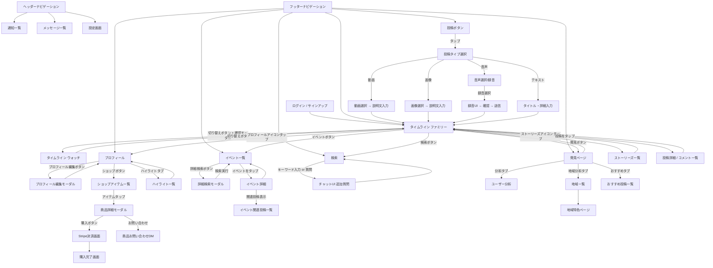

```mermaid
flowchart TB
    %% メインフロー
    A[ログイン / サインアップ] --> B[タイムライン ファミリー]
    B -- 切り替えボタン + 確認モーダル --> C[タイムライン ウォッチ]
    C -- 切り替えボタン --> B
    
    %% ヘッダーナビゲーション
    Header[ヘッダーナビゲーション]
    Header --> Notif[通知一覧]
    Header --> Messages[メッセージ一覧]
    Header --> Settings[設定画面]
    
    %% フッターナビゲーション
    Footer[フッターナビゲーション]
    Footer --> B
    Footer --> G
    Footer --> O
    Footer --> M
    Footer --> K
    Footer --> PostButton
    
    %% ストーリーズ
    B --> |ストーリーズアイコンタップ| D[ストーリーズ一覧]
    D --> B

    %% 投稿フロー
    PostButton[投稿ボタン] --> |タップ| PostType[投稿タイプ選択]
    PostType --> |動画| VideoPost[動画選択 → 説明文入力]
    PostType --> |画像| ImagePost[画像選択 → 説明文入力]
    PostType --> |音声| AudioPost[音声選択/録音]
    AudioPost --> |録音選択| RecordUI[録音UI → 確認 → 送信]
    PostType --> |テキスト| TextPost[タイトル・詳細入力]
    VideoPost --> B
    ImagePost --> B
    RecordUI --> B
    TextPost --> B

    %% 投稿詳細
    B --> |投稿をタップ| F[投稿詳細 / コメント一覧]
    F --> B

    %% プロフィール
    B --> |プロフィールアイコンタップ| G[プロフィール]
    G --> |プロフィール編集ボタン| H[プロフィール編集モーダル]
    H --> G
    G --> |ショップボタン| ShopView[ショップアイテム一覧]
    ShopView --> |アイテムタップ| ShopDetail[商品詳細モーダル]
    ShopDetail --> |購入ボタン| Payment[Stripe決済画面]
    Payment --> ThankYou[購入完了画面]
    ShopDetail --> |お問い合わせ| InquiryDM[商品お問い合わせDM]
    G --> |ハイライトタブ| J[ハイライト一覧]
    J --> G

    %% イベント
    B --> |イベントボタン| K[イベント一覧]
    K --> |詳細検索ボタン| EventSearch[詳細検索モーダル]
    EventSearch --> |検索実行| K
    K --> |イベントをタップ| L[イベント詳細]
    L --> |関連投稿表示| EventPosts[イベント関連投稿一覧]
    L --> K

    %% 検索
    B --> |検索ボタン| M[検索]
    M --> |キーワード入力 or 質問| N[チャットUI 追加質問]
    N --> M

    %% 発見ページ
    B --> |発見ボタン| O[発見ページ]
    O --> |分析タブ| Analysis[ユーザー分析]
    O --> |地域分析タブ| RegionList[地域一覧]
    RegionList --> RegionDetail[地域特色ページ]
    O --> |おすすめタブ| RecommendedPosts[おすすめ投稿一覧]
    O --> B
```