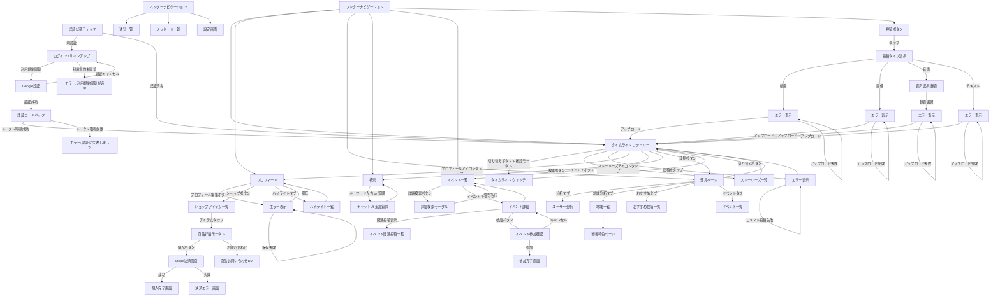

```mermaid
flowchart TB
    %% 認証フロー
    Auth[認証状態チェック] --> |未認証| A[ログイン / サインアップ]
    Auth --> |認証済み| B[タイムライン ファミリー]
    
    A --> |利用規約同意| GoogleAuth[Google認証]
    A -- 利用規約未同意 --> AError[エラー: 利用規約同意が必要]
    GoogleAuth --> |認証成功| Callback[認証コールバック]
    GoogleAuth -- 認証キャンセル --> A
    Callback --> |トークン取得成功| B
    Callback -- トークン取得失敗 --> AuthError[エラー: 認証に失敗しました]
    
    %% タイムライン切り替え
    B -- 切り替えボタン + 確認モーダル --> C[タイムライン ウォッチ]
    C -- 切り替えボタン --> B

    %% ヘッダーナビゲーション
    Header[ヘッダーナビゲーション]
    Header --> Notif[通知一覧]
    Header --> Messages[メッセージ一覧]
    Header --> Settings[設定画面]

    %% フッターナビゲーション
    Footer[フッターナビゲーション]
    Footer --> B
    Footer --> G
    Footer --> O
    Footer --> M
    Footer --> K
    Footer --> PostButton

    %% ストーリーズ
    B --> |ストーリーズアイコンタップ| D[ストーリーズ一覧]
    D --> B

    %% 投稿フロー
    PostButton[投稿ボタン] --> |タップ| PostType[投稿タイプ選択]
    PostType --> |動画| VideoPost[動画選択 → 説明文入力]
    PostType --> |画像| ImagePost[画像選択 → 説明文入力]
    PostType --> |音声| AudioPost[音声選択/録音]
    AudioPost --> |録音選択| RecordUI[録音UI → 確認 → 送信]
    PostType --> |テキスト| TextPost[タイトル・詳細入力]
    VideoPost --> |アップロード| B
    VideoPost -- アップロード失敗 --> VideoPost[エラー表示]
    ImagePost --> |アップロード| B
    ImagePost -- アップロード失敗 --> ImagePost[エラー表示]
    RecordUI --> |アップロード| B
    RecordUI -- アップロード失敗 --> RecordUI[エラー表示]
    TextPost --> |アップロード| B
    TextPost -- アップロード失敗 --> TextPost[エラー表示]

    %% 投稿詳細
    B --> |投稿をタップ| F[投稿詳細 / コメント一覧]
    F --> B
    F --> |コメント投稿| F
    F -- コメント投稿失敗 --> F[エラー表示]

    %% プロフィール
    B --> |プロフィールアイコンタップ| G[プロフィール]
    G --> |プロフィール編集ボタン| H[プロフィール編集モーダル]
    H --> |保存| G
    H -- 保存失敗 --> H[エラー表示]
    G --> |ショップボタン| ShopView[ショップアイテム一覧]
    ShopView --> |アイテムタップ| ShopDetail[商品詳細モーダル]
    ShopDetail --> |購入ボタン| Payment[Stripe決済画面]
    Payment --> |成功| ThankYou[購入完了画面]
    Payment --> |失敗| PaymentError[決済エラー画面]
    ShopDetail --> |お問い合わせ| InquiryDM[商品お問い合わせDM]
    G --> |ハイライトタブ| J[ハイライト一覧]
    J --> G

    %% イベント
    B --> |イベントボタン| K[イベント一覧]
    K --> |詳細検索ボタン| EventSearch[詳細検索モーダル]
    EventSearch --> |検索実行| K
    K --> |イベントをタップ| L[イベント詳細]
    L --> |関連投稿表示| EventPosts[イベント関連投稿一覧]
    L --> |参加ボタン| EventJoin[イベント参加確認]
    EventJoin --> |参加| EventJoined[参加完了画面]
    EventJoin --> |キャンセル| L
    L --> K
    

    %% 検索
    B --> |検索ボタン| M[検索]
    M --> |キーワード入力 or 質問| N[チャットUI 追加質問]
    N --> M

    %% 発見ページ
    B --> |発見ボタン| O[発見ページ]
    O --> |分析タブ| Analysis[ユーザー分析]
    O --> |地域分析タブ| RegionList[地域一覧]
    RegionList --> RegionDetail[地域特色ページ]
    O --> |おすすめタブ| RecommendedPosts[おすすめ投稿一覧]
    O --> |イベントタブ| EventList[イベント一覧]
    O --> B
    
```
