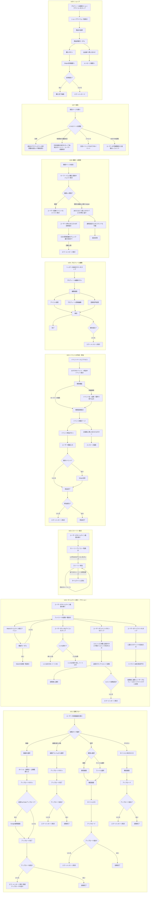

```mermaid
flowchart LR
    %% ユースケース別にサブグラフでまとめる

    subgraph UC1[UC1: 投稿フロー]
        A1[ユーザーが投稿画面を開く] --> A2{投稿タイプ選択}
        A2 -->|動画| A3[動画を選択]
        A2 -->|画像 最大10枚| A4[画像アルバムから選択]
        A2 -->|音声| A5{録音or選択}
        A2 -->|テキスト| A6[タイトルと本文を入力]
        
        A3 --> A31[タイトル・説明文・公開範囲入力]
        A31 --> A32[アップロードボタン]
        A32 --> A33{初回YouTubeアップロード?}
        A33 -->|はい| A34[Google連携画面]
        A33 -->|いいえ| A35[アップロード完了]
        A34 --> A35
        A35 --> A36{アップロード成功?}
        A36 -->|いいえ| A37[エラーメッセージ表示 再度アップロードを促す]
        A36 -->|はい| A38[投稿完了]

        
        A4 --> A41[アップロードボタン]
        A41 --> A42[アップロード完了]
        A42 --> A43{アップロード成功?}
        A43--> |いいえ| A44[エラーメッセージ表示]
        A43 -->|はい| A45[投稿完了]
        
        A5 -->|録音| A51[録音画面]
        A5 -->|ファイル選択| A52[ファイル選択]
        A51 --> A53[確認画面]
        A52 --> A53
        A53 --> A54[タイトル入力]
        A54 --> A55[アップロード]
        A55 --> A56{アップロード成功?}
        A56 -->|いいえ| A57[エラーメッセージ表示]
        A56 -->|はい| A58[投稿完了]
        
        A6 --> A61[確認画面]
        A61 --> A62[アップロード]
        A62 --> A63{アップロード成功？}
        A63 -->|いいえ| A64[エラーメッセージ表示]
        A63 -->|はい| A65[投稿完了]
    end

    subgraph UC2[UC2: タイムライン表示・アクション]
        B1[ユーザーがタイムライン画面を開く] --> B3[ファミリーの投稿一覧表示]
        B3 --> B20[Watchタイムライン表示アイコン]
        B20 --> B21[確認モーダル]
        B21 -->|はい| B4[Watchの投稿一覧表示]
        B21 -->|いいえ| B3

        %% いいね
        B3 --> B5[ユーザーがいいねアイコンをタップ]
        B5 --> B6{いいね済か？}
        B6 -->|未いいね| B7[いいねを付与 ハートON]
        B6 -->|いいね済| B8[いいねを取り消し ハートOFF]
        
        %% コメント
        B3 --> B9[ユーザーがコメントボタンをタップ]
        B9 --> B10[コメント入力欄と送信ボタンが表示 コメント本文を入力]
        B10 --> B11[送信ボタンでコメント投稿]
        B11 --> B12[投稿者に通知]
        B11 --> B17{コメント投稿成功?}
        B17 -->|いいえ| B18[エラーメッセージ表示]

        %% ハイライト
        B3 --> B13[ユーザーがハイライトをタップ]
        B13 --> B14[心震えたポイントを自由入力]
        B14 --> B15[ハイライト送信 取消不可]
        B15 --> B16[投稿者に通知 ユーザープロフィールのハイライトタブに追加]
    end

    subgraph UC3[UC3: ストーリー表示]
      C1[ユーザーがタイムライン画面を開く] --> C2[ストーリーアイコン一覧表示]
      C2 -->|いずれかのアイコンをタップ| C3[ストーリー再生]
      C3 -->|次のストーリーへ| C3
      C3 -->|全てのストーリーを再生終了| C4[タイムラインに戻る]
    end

    subgraph UC4[UC4: イベントの作成・参加]
        D1[イベントページにアクセス] --> D2[おすすめイベント・参加中イベント表示]
        D2 --> D3[検索機能]
        D3 -->|キーワード検索| D4[検索結果表示]
        D3 -->|詳細検索| D5[イベント名・金額・場所で絞り込み]
        D5 --> D4
        
        D4 --> D6[イベント詳細ページ]
        D6 --> D7[イベント参加ボタン]
        D7 --> D8[ユーザー情報入力]
        D8 --> D9{有料イベント?}
        D9 -->|はい| D10[Stripe決済]
        D9 -->|いいえ| D11[参加完了]
        D10 --> D11
        D11 --> D12{参加成功？}
        D12 --> |いいえ| D13[エラーメッセージ表示]
        D12 -->|はい| D14[参加完了]

        
        D6 --> D15[主催者に問い合わせるボタン]
        D15 --> D16[メッセージ画面]
    end

    subgraph UC5[UC5: プロフィール編集]
        E1[ヘッダーの設定ボタンをタップ] --> E2[プロフィール編集ボタン]
        E2 --> E3[編集画面]
        E3 --> E4[アイコン変更]
        E3 --> E5[プロフィール情報編集]
        E3 --> E6[登録音声変更]
        E4 --> E7[保存]
        E5 --> E7
        E6 --> E7
        E7 --> E8[完了]
        E7 --> E9{保存成功？}
        E9 --> |いいえ| E10[エラーメッセージ表示]
    end

    subgraph UC6[UC6: 検索・AI質問]
        F1[検索ページを開く] --> F2[キーワード入力欄と質問サジェスト表示]
        F2 --> F3{検索 or 質問？}
        F3 -->|検索| F4[ユーザー/投稿/イベントなどリスト表示]
        F3 -->|質問 目醒めに関するQ&A| F5[あなたはどう思いますか？とAIが問い返す]
        F5 --> F6[ユーザーが考えを入力 AIが回答提示]
        F6 --> F7[1日の質問回数をチェック 最大5回まで]
        F7 -->|回数上限| F8[エラーメッセージ表示]

        
        %% SNS設定の指示も可能
        F5 --> F9[通知設定などのコマンドも可能]
        F9 --> F10[設定反映]
    end

    subgraph UC7[UC7: 発見]
        G1[発見ページを開く] --> G2{4つのパートを閲覧}
        G2 -->|分析| G3[直近のアクティビティ分析 目醒め度合いや傾向表示]
        G2 -->|地域毎の活動状況| G4[日本地図の地方をタップ 各地方のイベント・ユーザー活動表示]
        G2 -->|イベント| G5[注目イベントやおすすめイベント]
        G2 -->|おすすめ投稿| G6[ユーザーの行動履歴から投稿をレコメンド]
    end
   subgraph UC8[UC8: ショップ]
    H1[プロフィール画面のショップアイコンをタップ] --> H2[ショップアイテム一覧表示]
    H2 --> H3[商品を選択]
    H3 --> H4[商品詳細モーダル]
    H4 --> H5[購入ボタン]
    H5 --> H6[Stripe決済画面へ]
    H6 --> H7{決済成功？}
    H7 -->|はい| H8[購入完了画面]
    H7 -->|いいえ| H9[エラーメッセージ]
    H4 --> H10[出品者へ問い合わせ]
    H10 --> H11[メッセージ画面へ]
   end
```